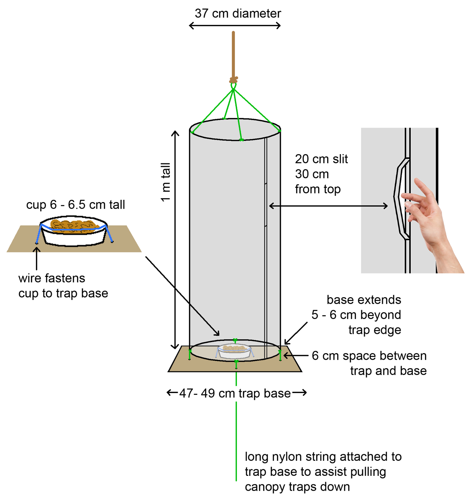

```{r setup, include = FALSE}
knitr::opts_chunk$set(echo = TRUE, fig.align = "center", cache = TRUE)
options(dplyr.width = Inf)
```

# Executive summary

This research addressed two questions:

1. Are standardized butterfly traps an effective way to quantify the butterfly fauna of the Mohonk Preserve?
1. Has climate change impacted emergence time of the butterfly fauna of the Mohonk Preserve?

    1. During the late Spring and early Summer of 2016 I established transects for standardized butterfly traps at three locations on the Mohonk Preserve: **Spring Farm**, **White Oak**, and **Glory Hill**. These traps were baited with fermented bananas and monitored following a protocol established by Conservation International for fruit-feeding butterflies. This was the first application of this protocol in North America. Briefly, traps were baited and checked daily for three days and any butterflies present in the traps were identified, marked, and released. Other butterflies encountered in proximity to the traps were also identified and their abundances noted. Following each survey period, the traps were idle for two weeks and the trapping cycle resumed.  After three trapping periods (nine survey days over six weeks) a total of three butterfly species were captured in the traps with no recaptures. I observed an additional 12 species of butterfly in significant abundances at the sites that were never observed in the traps. The low butterfly diversity observed in the traps, and higher diversity outside the traps, strongly suggests that this method is not ideal to monitor butterfly biodiversity at the Mohonk Preserve.

    1. The Mohonk Preserve has collected weather data continuously for over 100 years and observed the first occurrence of butterfly species for nearly as long. I was able to access the preserve's weather data for dates beginning in 1896. Using a variety of statistical methods I detected the signature of climate change at the Mohonk Preserve. Since 1980 the average annual temperature has increased by 1$^{\circ}$C at the Mohonk Preserve. Using statistical modelling, I predict that this upward trend is likely to continue with a 0.25$^{\circ}$C increase over the next 10 years. I requested but was not given the corresponding butterfly observational data and could not investigate how this temperature increase has affected the butterfly fauna of the Mohonk Preserve.

    All data and the statistical code required to reproduce this document are freely available on the internet and can be found at this projects [`GitHub` page](https://github.com/butterflyology/Mohonk_report).
    
***


# Introduction

## Population size

Standardized trap sampling fruit-feeding nymphalid butterflies has been shown to be an effective means for understanding butterfly diversity in space and time, and for use in conservation efforts (DeVries and Walla 2001; Hill and Hamer 2004; @Molleman:2006eo; @DeVries:2011p11993; @Freitas:2014tm). Conservation International, a world leader in assessing biodiversity, has produced a standard protocol to estimate butterfly biodiversity that can be employed anywhere in the world (@DeVries:2016vi). 

The data generated by these trap studies will allow the estimation of population size as well as species richness turnover, which are important first steps in monitoring the health and viability of local species. Once determined, the Mohonk Preserve will be able to monitor these populations (perhaps incorporating citizen scientists) and detect changes in the preserve before they are visually evident (Agosti et al. 2000).

The Nymphalidae is the largest family of butterflies, and the fruit-feeding butterflies may comprise up to 50% of the nymphalid species richness in tropical forests (DeVries et al. 2012). 

Fruit-feeding nymphalids at the Mohonk preserve include members of the genera *Nymphalis*, *Speyeria*, *Phyciodes*, *Vanessa*, and *Polygonia.* One of the most salient characteristics of this group is that they can be sampled in a standardized manner to avoid human collector biases, thus facilitating comparisons of species richness, composition and abundance within and among habitat types. For these reasons, I propose focusing standardized sampling methods exclusively on fruit-feeding nymphalids, rather than on the entire butterfly community.  There are many trap studies now being conducted.

Most of these are, however, not directly comparable because they do not use consistent trap designs and protocols (see examples and citations in DeVries 1987, DeVries & Walla 2001, Batra 2006, Frietas et al. 2015). The sampling protocol provided here is based on more than 10 years of monthly sampling conducted in lowland forests at Garza Cocha, Sucumbios Province, Ecuador and the Tirimbina Biological Reserve Heredia Province, Costa Rica that have been demonstrated to be directly comparable (DeVries & Walla 2001, DeVries et al. 2012).  


## Global climate change

  Global climate change is one of the most serious threats to biodiversity of natural and human ecosystems, affecting both the distribution of species and the timing of biological events (Amano et al. 2010). Since the 1980’s mean annual temperature in the Northeastern United States has risen approximately 2$^{\circ}$F. Some of this increase has occurred during the late winter and early spring seasons, resulting in a seasonal warm up 5-10 days earlier than was the case in 1980 (Andresen and Winkler 2009). Herbivorous insects, such as butterflies, must be synchronized with their host plants such that food resources are available to the insects at critical stages of development. If this symbiosis is disturbed, as has been predicted with global change, there may be limited resources available for developing larvae (Parmesan 2007).

  Using an approach similar to that of Cook et al. (2008), I will use the wealth of natural history observations available at the Mohonk Preserve, such as first occurrence records, to correlate emergence with existing weather data from the Mohonk Preserve. In addition to the data collected by Mohonk Preserve personnel, the American Museum of Natural History has numerous specimens in their collection, many dating back over 100 years, that have been collected in the surrounding region. The relationship between insect emergence and accumulated degree days (a measure of total heating) is well established and remains constant for particular species (Pedigo 2002). Significant warming has occurred in the Northeastern United States since 2002 (IPCC 2013), which was the most recent date that Cook et al. (2008) incorporated into their study. If warming has occurred at the Mohonk Preserve the calendar date of an event should occur earlier in the year and is detectable using common statistical models, such as time series analysis and eigenvalue decomposition (Barnett et al. 1999). I will then use projections of future climate change to examine how the butterfly community may respond to the predicted changes (Winkler et al. 2011). 


```{r preliminaries, include = FALSE}
set.seed(249823597)

library("vegan")
library("vegetarian")
library("tidyverse")
library("spaceMovie")
library("ggmap")
library("mgcv")
library("xts")
library("astsa")
library("forecast")
library("prophet")
```

***

# Trap study

## Locations

Transects were established at **Spring Farm**, **White Oak**, and **Glory Hill**.
```{r Map_prep, include = FALSE}
Mohonk_lon_lat <- data.frame(lon = c(-74.1283, -74.14995, -74.13538), lat = c(41.79586, 41.75146, 41.75487))

Mohonk_map <- get_map(location = colMeans(Mohonk_lon_lat), source = "google", maptype = "satellite", zoom = 13)

Traps_plot <- ggmap(Mohonk_map) +
  geom_point(data = Mohonk_lon_lat, aes(x = lon, y = lat, color = SW_palette("Inquisitor")[1]), size = 4) +
  xlab("Longitude") +
  ylab("Latitude") +
  theme(legend.position = "none") +
  annotate("text", x = -74.1283, y = 41.8, label = "Spring Farm", col = "white") +
  annotate("text", x = -74.14995, y = 41.7555, label = "Glory Hill", col = "white") +
  annotate("text", x = -74.13538, y = 41.759, label = "White Oak", col = "white")
```

```{r print_map, echo = FALSE, fig.cap = "Trap locations on Mohonk Preserve"}
print(Traps_plot)
```

  Modified from @DeVries:2016vi: A completed trap is a cylinder 1 m tall and 37 cm in diameter with a closed top and open bottom (Fig 2). Two metal ring frames are sewn into the top and bottom, and the netting must completely close the top of the cylinder. The cylinder was sewn such that the netting overlaps on the long axis by 2 cm leaving a 20 cm unsewn slit approximately 30 cm from the top to allow access to the trap interior. A 47-49 cm square trap base (3 mm of durable corrugated plastic) was suspended from the bottom ring of the cylinder such that is hung 6 cm below the opening of the cylinder. The diameter of the trap base extended 5-6 cm beyond the cylinder diameter. Holes were drilled on each side, and plastic cable ties were used to attach the base to the trap.

  A small plastic bait cup was secured to the center of the base with a loop of thin, stiff wire that passed through two holes drilled in the base. The wire was then pressed down into the mouth of the cup to keep the bait cup upright and centered on the base. The receptacle for the bait had a volume of at least 200 ml (8 ounces), and was just be tall enough to pass between the base and lower trap ring. A length of nylon cord was secured to the bottom of the trap base to assist securing traps. 
  
  Bait: Traps were baited with locally obtained bananas that were first chopped into 2-3 cm pieces and pureed with an auger in a large container (that had a lid). Approximately 15 pounds of bananas were used over the course of this project. The pureed bananas were allowed to ferment in the sealed container for 48 hours prior to use. The day before trapping approximately 150-200 ml of banana mash was added to the bait receptacle in each trap such that the bait level is below the top of the receptacle. Sampling began on the next day. Following each sampling period the banana puree was removed from the trap. 

<center>

</center>


## Diversity 

Diversity estimates

```{r load_traps, include = FALSE}
BData <- read_csv("data/Mohonk_traps_data.csv", col_names = TRUE)
str(BData)
head(BData)

BData <- BData %>% 
	unite(Day, Month, Year, col = Date, sep = "_") %>% 
	group_by(Date, Site) %>% 
	summarize(M_cymela = sum(M_cymela), 
			      P_polyxenes = sum(P_polyxenes), 
			      C_pegala = sum(C_pegala))

colSums(BData[, 3:5])
```

| Species | Count | 
|:---|:--:|
| *Cercyonis pegala* | 6 |
| *Megisto cymela* | 14 |
| *Papilio polyxenes* | 6|
Table: Species encountered in traps and the sum of all counts. 

| Species | Observed |
|:---|:--:|
| *Battus philenor* | 2 |
| *Celastrina ladon* | 2 |
| *Cercyonis pegala* | 5 |
| *Chlosyne harrisii* | 1 |
| *Coenonympha tullia* | 6 |
| *Colias eurytheme* | 2 |
| *Cupido comyntas* | 4 |
| *Danaus plexippus* | 3 |
| *Enodia anthedon* | 3 |
| *Epargyreus clarus* | 3 |
| *Euphydryas phaeton* | 3 |
| *Erynnis juvenalis* | 5 |
| *Junonia coenia* | 2 |
| *Limenitis arthemis* | 1 |
| *Megisto cymela* | 4 |
| *Papilio canadensis* | 1 |
| *Papilio cresphontes* | 1 |
| *Papilio glaucus* | 2 |
| *Papilio polyxenes* | 1 |
| *Phyciodes tharos* | 4 |
| *Pieris virginiensis* | 4 |
| *Polygonia comma* | 1 |
| *Nymphalis antiopa* | 6 |
| *Nymphalis vaualbum* | 1 | 
| *Satyrodes eurydice* | 4 |
| *Speyeria cybele* | 2 |
| *Vanessa virginiensis* | 3 |
Table: Species encountered in proximity to traps.

```{r trap_munge, include = FALSE}
GH <- BData %>% filter(Site == "GH") %>% select(-Site)
GH <- GH[, 2:4]
GH

SF <- BData %>% filter(Site == "SF") %>% select(-Site)
SF <- SF[, 2:4]
SF

WO <- BData %>% filter(Site == "WO") %>% select(-Site)
WO <- WO[, 2:4]
WO

GH1 <- d(GH, lev = "alpha", q = 1)
GH1

# A simple function to calculate a range of q values for a, b, and g diversity
D.iter.q <- function(data, level, q){
Spoon <- matrix(data = NA, ncol = 1, nrow = 6)
  for (i in 1:6){
  temp <- d(data, lev = level, q = i - 1, boot = FALSE)
  Spoon[i, 1] <- temp[[1]]
  }
  return(Spoon)
}
```

```{r trap_iter, echo = FALSE}
GHa <- D.iter.q(data = GH, level = "alpha", q = 5)
WOa <- D.iter.q(data = WO, level = "alpha", q = 5)
SFa <- D.iter.q(data = SF, level = "alpha", q = 5)

GHb <- D.iter.q(data = GH, level = "beta", q = 5)
WOb <- D.iter.q(data = WO, level = "beta", q = 5)
SFb <- D.iter.q(data = SF, level = "beta", q = 5)

GHg <- D.iter.q(data = GH, level = "gamma", q = 5)
WOg <- D.iter.q(data = WO, level = "gamma", q = 5)
SFg <- D.iter.q(data = SF, level = "gamma", q = 5)

plotDeMoney <- function(x0, y0, x1, y1, mean, dot){
	points(y = mean, x = dot, pch = 15, col = 'grey', cex = 1.5)
  segments(x0, y0, x1, y1, lwd = 3.5)
}
```

```{r trap_plot, echo = FALSE, include = TRUE, fig.cap = "Species richness estimates based on traping.", warning = FALSE}

par(mar = c(1, 5, 0, 0))
par(fig = c(0, 1, 0.65, 1), new = TRUE)

par(mar = c(3, 6, 1, 1))
plot.new()
plot(x = seq(from = 0, to = 5, length.out = 4), y = seq(from = 0, to = 4.2, length.out = 4), xaxt = "n", type = "n", ylab = "", las = 1, xlab = "", main = "Spring Farm")
points(y = SFb[, 1], x = seq(0, 5), pch = 19, cex = 1.5)


par(fig = c(0, 1, 0.35, 0.70), new = TRUE)
par(mar = c(3,6,1,1))
plot.new()
plot(x = seq(from = 0, to = 5, length.out = 4), y = seq(from = 0, to = 4.2, length.out = 4), xaxt = "n", type = "n", ylab = "", las = 1, xlab = "", main = "White Oak")
points(y = WOb[, 1], x = seq(0, 5), pch = 19, cex = 1.5)
mtext(expression(paste(italic(beta))), side = 2, padj = -1.3, srt = 0, cex = 2)


par(fig = c(0, 1, 0, 0.35), new = TRUE)
par(mar = c(3, 6, 1 ,1))
plot.new()
plot(x = seq(from = 0, to = 5, length.out = 4), y = seq(from = 0, to = 4.2, length.out = 4), xaxt = "n", type = "n", ylab = "", xlab = "", las = 1, main = "Glory Hill")
axis(1, at = c(0, 1, 2, 3, 4, 5))
points(y = GHb[, 1], x = seq(0, 5), pch = 19, cex = 1.5)
mtext(expression(paste(italic("q"))), 1, padj = 2, cex = 1.5)
```


```{r turn_off, echo = FALSE}
#par(mfrow = c(1, 1))
```

Butterfly sampling through the use of baited traps at the Mohonk Preserve did not produce the desired results. While the method did trap butterflies the diversity estimates generated were far below the observed values immediately adjacent to the traps (Tables 1 & 2). This was the first application of this method in North America, and has at least demonstrated how not to estimate butterfly biodiversty in New York. Future attempts to assess the butterfly community at the Mohonk Preserve should utilize alternative methods.

***


# Climate change

```{r load_temperature, warning = TRUE, include = FALSE}
weather_data <- read_csv("data/Mohonk_temp.csv", col_names = TRUE, col_types = list(DATE = col_date("%m/%d/%Y"))) # minor parsing failure for a leap year

weather <- weather_data %>% 
	select(DATE, MAX, MIN) %>% 
	mutate(Max_Celsius = ((MAX - 32) * (5/9)), 
		Min_Celsius = ((MIN - 32) * (5 / 9)),
		mean_C = ((Max_Celsius + Min_Celsius)/2))
```


```{r by_month, include = FALSE}
monthly_temps <- weather_data %>%
  separate(DATE, into = c("YEAR", "MONTH", "DAY"), convert = TRUE) %>%
  group_by(YEAR, MONTH) %>% 
  mutate(Max_Celsius = ((MAX - 32) * (5/9)), 
         Min_Celsius = ((MIN - 32) * (5 / 9)), 
         mean_C = ((Max_Celsius + Min_Celsius) / 2)) %>%
  filter(YEAR <= 2015) %>%
  summarize(MEAN_MONTH_C = mean(mean_C, na.rm = TRUE))

monthly_ts <- ts(monthly_temps$MEAN_MONTH_C, start = c(1900, 1), end = c(2015, 12), freq = 12)
head(monthly_ts)
tail(monthly_ts)
str(monthly_ts)
```


## Temperature by month

It is informative to consider how temperature may have changed by month.

```{r tile_plot, echo = FALSE, fig.cap = "Monthly mean temperature by month and year."}
ggplot(monthly_temps, aes(y = MEAN_MONTH_C, x = YEAR, col = as.factor(MONTH))) + 
  geom_point() + 
  facet_wrap( ~ MONTH, labeller = as_labeller(c("1" = "Jan", "2" = "Feb", "3" = "Mar", "4" = "March", "5" = "May", "6" = "June", "7"= "July", "8" = "Aug", "9" = "Sep", "10" = "Oct", "11" = "Nov", "12" = "Dec"))) +
  geom_smooth(method = "lm", se = TRUE, col = "black") +
  theme(legend.position = "none") + 
  ylab(expression("Mean monthly temp" *~degree*C)) + 
  scale_color_manual(values = SW_palette("ROTS", type = "continuous", n = 12))
```


## General additive model


We seek a model that explains the underlying data. Given the complex and fluctuating nature of temperature data it makes little sense to apply a linear model . I followed the method of @JGRD:JGRD17833 and applied a generalized additive mixed model (gamm) that fits a series of local regressions to the data (thin-plate regression spline) that allows incorporation of the correlated residuals. This analysis was implemented using the `gamm()` function of the `mgcv` package [@bath22707, @bath32382, @bath7011]


Incorporates a smoothing parameter to accommodate the fluctuating nature of the data. 

$$Y = \beta_0 + \beta_1(Year) + \epsilon$$

$$\epsilon \sim N(0, \sigma^{2} \Lambda)$$


```{r gamm, echo = FALSE, warning = FALSE, include = FALSE}
year_temps <- weather_data %>%
  separate(DATE, into = c("YEAR", "MONTH", "DAY"), convert = TRUE) %>%
  group_by(YEAR) %>% 
  mutate(Max_Celsius = ((MAX - 32) * (5/9)), 
         Min_Celsius = ((MIN - 32) * (5 / 9)), 
         mean_C = ((Max_Celsius + Min_Celsius) / 2)) %>%
  filter(YEAR <= 2015) %>%
  summarize(MEAN_YEAR_C = mean(mean_C, na.rm = TRUE)) %>% 
  mutate(centered = MEAN_YEAR_C - mean(MEAN_YEAR_C))


gamm1 <- gamm(centered ~ s(YEAR), data = year_temps, correlation = corARMA(form = ~ YEAR, p = 1))
summary(gamm1$gam)

gamm2 <- gamm(centered ~ s(YEAR), data = year_temps, correlation = corARMA(form = ~ YEAR, p = 2))
summary(gamm2$gam)

anova(gamm1$lme, gamm2$lme) # model one does a slightly better job modeling the residual correlation

source("code/simulate_gamm.R")

sim_data <- with(year_temps, data.frame(YEAR = seq(min(YEAR), max(YEAR), length.out = 200)))
simulations <- simulate(gamm1, nsim = 10000, newdata = sim_data)

conf_int <- apply(simulations, 1L, quantile, probs = c(0.025, 0.975))

new_data <- transform(sim_data, fitted = predict(gamm1$gam, newdata = sim_data), lower  = conf_int[1, ], upper  = conf_int[2, ])
```


```{r ribbon_plot, echo = FALSE, warning = FALSE, message = FALSE, fig.cap = "Plot of mean annual temperature with `gamm` line."}
ggplot(year_temps, aes(x = YEAR, y = centered)) +
  geom_point() +
  theme_bw() +
  ylab(expression("Centered temperature " *~degree*C)) + 
  xlab("Year") +
  geom_ribbon(data = new_data, aes(ymin = lower, ymax = upper, x = YEAR, y = fitted), alpha = 0.4, fill = "grey") +
  geom_line(data = new_data, aes(y = fitted, x = YEAR))
```


| Model | df  | AIC | BIC | logLik | Test | L.Ratio | p-value |
|:---:|:---:|:---:|:---:|:---:|:---:|:---:|:---:|
|1| 5 | 254.05 | 267.82 | -122.03 |       |  |  |
|2| 6 | 256.03 | 272.55 | -122.02 | 1 vs 2 | 0.021 | 0.88 |
Table: ANOVA table comparing AR(1) and AR(2) models. 


## Prediction - ARIMA

I used an `ARIMA` (**A**uto**R**egressive **I**ntegrated **M**oving **A**verage) model.

```{r sarima, echo = FALSE, eval = FALSE, message = FALSE}
# diff is used to identify the model type (MA, AR)
# This is it, looks good!
plot(diff(year_temps$centered), type = "l", ylab = "", las = 1) # Taking the diff shows stationarity!
plot(acf2(year_temps$centered), pch = 19, las = 1)
plot(acf2(diff(year_temps$centered)), pch = 19, las = 1)
plot(pacf(diff(year_temps$centered)), main = "", las = 1)

sarima(year_temps$centered, 1, 0, 0) # Not so good
sarima(year_temps$centered, 0, 0, 1) # Not so good
sarima(year_temps$centered, 1, 0, 1) # Nice.

# Given the acf2 plot, two more models also seem plausible: ARIMA(1, 1, 1) and ARIMA(0, 1, 2)
sarima(year_temps$centered, 1, 1, 1) 
sarima(year_temps$centered, 0, 1, 2) 

# Now let's overfit the model and see how it changes.  If adding parameters changes the results drastically, then you should rethink your model. If, however, the results do not change by much, you can be confident that your fit is correct.

# decent plot
plot(y = year_temps$centered, x = year_temps$YEAR, type = "l", pch = 19, xlim = c(1900, 2020), las = 1, ylab = expression(paste("Centered temperature ") ~degree~C), xlab = "Year", lwd = 1.5)
```

```{r sarima_plot, echo = FALSE, results = "hide", message = FALSE}
# create a ts object
yr_ts <- ts(data = year_temps$centered, start = 1900, end = 2015)

# Once the model is chosen, let's forecast.
source("code/sarima_for.R")
sarima_for(yr_ts, n.ahead = 10, 0, 1, 2)
# Nearly all of the predicted error is for positive warming

# convert year_temps to xts/ts for to make pretty. Maybe do by month? 

# This model is a bit simplistic because it is condensing a lot of information into monthly averages
```

```{r forecast, echo = FALSE, eval = FALSE, message = FALSE}
# This plot looks good (aka correct)
autoplot(yr_ts) +
  ylab(expression(paste("Centered temperature ") ~degree~C)) +
  xlab("Year") +
  theme_bw()

# Training and test sets, cross-validoation
yr_ses <- ses(yr_ts, h = 5)

autoplot(yr_ses) +
  ylab("Temperature") +
  xlab("Year") +
  autolayer(fitted(yr_ses)) +
  theme_bw() +
  theme(legend.position = "none") +
  labs(title = "")

yr_window <- window(yr_ts, start = 1900, end = 1999)

yr_ses_train <- ses(yr_window, h = 5)
yr_naive_train <- naive(yr_window, h = 5)

summary(yr_ses_train)
summary(yr_naive_train)

accuracy(yr_ses_train, yr_ts)
accuracy(yr_naive_train, yr_ts)

# ETS and ARIMA models have trouble with weekly (k = 52) data, use harmonic regression. 

# This code is NOT correct, does not give a proper time series
# monthly_ts2 <- ts(monthly_temps2$mean_C, start = 1900, end = 2015, frequency = 12)
glimpse(monthly_ts)

autoplot(monthly_ts)

monthly_ts_window <- window(monthly_ts, start = 1970, end = 2015)

autoplot(monthly_ts_window) +
  ylab(expression(paste("Temperature ") ~degree~C)) +
  xlab("Year")


# These do NOT look good
ggseasonplot(monthly_ts_window)
ggseasonplot(monthly_ts_window, polar = TRUE)


# Holt's exponential smoothing
yr_holt <- holt(yr_ts, h = 10)
checkresiduals(yr_holt) # looks good

# This is roughly the same as sarima but prettier.
autoplot(yr_holt) +
  autolayer(fitted(yr_holt)) +
  theme_bw() +
  theme(legend.position = "none") +
  labs(title = "") +
  ylab(expression(paste("Centered temperature ") ~degree~C)) +
  xlab("Year")

yr_ets <- ets(yr_ts) # best model is (A, N, N): A - Additive errors, N - No trend, and N - No seasonality.

yr_ets_fc <- forecast(yr_ets, h = 10)
autoplot(yr_ets_fc)

yr_ts %>% 
  ets() %>% 
  forecast(h = 10) %>% 
  autoplot()
```

```{r forecast_plot, echo = FALSE, message = FALSE, warning = FALSE}
# forecast arima models
yr_arima <- auto.arima(yr_ts, stepwise = FALSE)
#summary(yr_arima)

yr_arima %>% 
  forecast(h = 10) %>% 
  autoplot() +
  autolayer(fitted(yr_arima)) +
  theme_bw() +
  theme(legend.position = "none") +
  labs(title = "") +
  ylab(expression(paste("Temperature ") ~degree~C)) +
  xlab("Year")
```


```{r monthly, eval = FALSE, echo = FALSE, message = FALSE}
autoplot(monthly_ts) +
  theme_bw() +
  theme(legend.position = "none") +
  labs(title = "") +
  ylab(expression(paste("Temperature ") ~degree~C)) +
  xlab("Year")

hw_add <- hw(monthly_ts, seasonal = "additive", h = 72)
autoplot(hw_add)
checkresiduals(hw_add) # Fail


ets(monthly_ts) # Additive error, No trend, Additive seasonality
checkresiduals(ets(monthly_ts)) # fail

monthly_ts %>% 
  ets() %>% 
  forecast(h = 72) %>% 
  autoplot() +
    xlim(1985, 2022) +
    theme_bw() +
    theme(legend.position = "none") +
    labs(title = "") +
    ylab(expression(paste("Temperature ") ~degree~C)) +
    xlab("Year")

# crap. ARIMA not good with monthly data
month_arima <- auto.arima(monthly_ts) # bad

# Harmonic regression
month_four <- fourier(monthly_ts, K = 2)

month_fit <- auto.arima(monthly_ts, xreg = month_four, seasonal = FALSE)
summary(month_fit)
checkresiduals(month_fit)

month_fc <- forecast(month_fit, xreg = month_four, h = 52)
# str(month_fc)

autoplot(month_fc) +
    xlim(1985, 2022) +
    theme_bw() +
    theme(legend.position = "none") +
    labs(title = "") +
    ylab(expression(paste("Temperature ") ~degree~C)) +
    xlab("Year")

# TBATS
month_tbats <- tbats(monthly_ts)

month_tbats %>% 
  forecast(h = 120) %>% 
  autoplot() +
  xlim(1985, 2025) +
  theme_bw() +
  theme(legend.position = "none") +
  ylab(expression(paste("Temperature ") ~degree~C)) +
  xlab("Year") +
  labs(title = "")
#  autolayer(fitted(month_tbats))

 
```

Forecast is the mean of a series of simulated futures based on the model that best fits our data. 

The forecast predicts that annual temperature will continue to be above the mean for the past 115 years. 


## Prediction - `prophet`

```{r prophet, echo = FALSE, warning = FALSE, message = FALSE, results = "hide"}

monthly_temps_prophet <- monthly_temps %>% 
  unite(YM, YEAR, MONTH, sep = "-") %>% 
  rename(ds = YM, y = MEAN_MONTH_C) %>% 
  mutate(ds = as.yearmon(ds, format = "%Y-%m"))
  

prophet_predict <- prophet(monthly_temps_prophet)
prophet_future <- make_future_dataframe(prophet_predict, periods = 1000)
prophet_forecast <- predict(prophet_predict, prophet_future)

# tail(prophet_forecast)
plot(prophet_predict, prophet_forecast) +
  theme_bw() +
  xlab("Year") +
  ylab(expression("Mean monthly temp" *~degree*C))


prophet_plot_components(prophet_predict, prophet_forecast) 

```


***
# Literature cited

